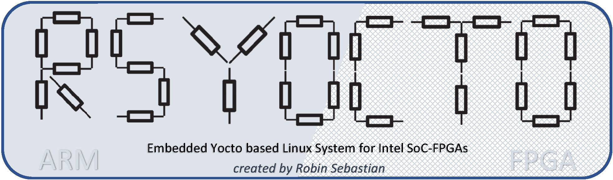

	

### *rsYocto* is an open source embedded Linux System designed with the Yocto Project and optimized for Intel SoC-FPGAs (*Intel Cyclone V* and *Intel Arria 10* with a *ARM CORTEX-A9*) to achieve the best customization for the strong requirements of modern embedded applications.

	 
	 	 
	 
	 
	 

___

*rsYocto* implements a **modern Linux Kernel (linux-socfpga 5.5)** and brings a set of today fundamentally needed components to **Intel SoC-FPGAs** and helps to **simplify the complex process of development** for FPGA-, Industrial 4.0-, Internet of things- or deep learning applications.

To realize that **Python3** with the Python Package manager **pip (PyPI)** and the **Apache Webserver** with **PHP** are already included. Thereby it is really easy to install Python applications from the *Raspberry Pi* on a powerful Intel SoC-FPGA. *rsYocto* is for its best optimization complete console based, but the Apache Webserver can bring any GUI to Computers, Smartphones or Tablets, by hosting for example a monitor web interface. For that is the python Web framework **Django 3.0** with the **AdminLTE** Dashboard pre-installed.

During development, a major concern was placed on the integration of **powerful and simple to install development IDEs** that do not require a JTAG-connection or any cross-building environment. All kinds of *rsYocto* applications and parts can **build, deployed and even debugged over the network** (fully rootable over the Internet). With the implementation of *Microsoft Visual Studio* and *Visual Studio Code* is a simple installment and quick jump start in the development process possible, because all required compilers run directly on *rsYocto*.

It is with the implementation of drivers for **all Hard-IP Interfaces** (e.g. **I²C-, CAN-BUS,…**) and simple Linux test commands (e.g. **i2c-tools** or **can-utils**) ready for the development of industrial connected solutions. With a single command *rsYocto* is capable to **load a new FPGA configuration** or to **read and write the AXI-Bridge Interface to the FPGA fabric**.

The “*makersYoctoSDImage*”- script allows developer to **customize the *rsYocto*-image** with the installment of their own **applications**, **scripts** or **FPGA configuration files, that will be configured on the FPGA fabric before the Linux boots**.

The final *rsYocto*-Image can be **installed** on a **SD-Card** with any commonly **used Boot-Image creating tools**. Versions are available for the **Terasic DE10 Standard-** (Cyclone V), **Terasic DE10 Nano-** (Cyclone V) and **Terasic Han Pilot** (Arria 10).

On the Terasic DE10 Nano board the **Arduino Uno header** can be used to connect external devices to a Hard-IP Bus, because the HPS interfaces with the pre-installed configuration are routed to FPGA I/O-Pins. 

 
I noticed that right now only desktop Linux systems, like Ubuntu, are available for free. In my opinion they are not designed for embedded SoC-FPGAs and therefore, they cannot be considered for long-term embedded systems.

That was for me the starting point to try to develop my own fully optimized Linux distribution. Shortly after, I announced that the *Intel* development tools and documentations for HPS development are not nearly as good as those for the FPGA part. At the beginning it was really complicated to get anything running. 
After a hard time, I'm able to present this first working project. To get there, **I designed my own built flow with my own scripts**.

I think nearly everybody will have the same problems that I had during the development. For that reason, **I try to give everybody a solution for their rapid prototyping**.
Within this repository I also integrated a step by step guide to show my solution with the Yocto project and the Intel EDS.

**This project is by far not finished and issue free. I will continue my work and upload newer versions. I invite everybody to submit issues, comments and ideas.**

 

# System Overview of rsYocto

___

**Build, debug and deploy your applications over the network**

**Ready for powerful remote development IDEs and fitted with a Web server to host modern web applications**
 
 

# Key Advantages

* **Embedded Linux specially developed for Intel SoC-FPGAs**
* Full **usage of the Dual-Core ARM Cortex A9** with
	* the **NEON-Engine**
	* the **vector floating point unit (VFP)** 
	* the **Thumb-2 instruction set**
* For the best performance completely custom optimized 
* **Console based** (**GUI less**) with `Busybox`
* **Watchdog** timer is enabled    
 

* **FPGA fabric configuration during the boot and with a single Linux command**
* **Tools to interact with the FPGA fabric via the HPS to FPGA bridges**
* **Access the FPGA fabric with Shell scripts, C++-, Python-Applications or PHP or Django web applications**
* **HPS Hard IP components (I²C-,SPI-, CAN-BUS or UART) are routed to FPGA I/O**
	* Ready for connecting different devices 
		* e.g. **Arduino Uno shields**
* Console based Bus test tools (e.g. `can-utils`)
 

* Ethernet with **dynamic and static iPv4** is supported
* **SSH-Server** starts automatically
* **Support for remote based development IDEs pre-installed**
	* *Visual Studio Code* for **remote python debugging**
	* *Visual Studio* for **remote C++ debugging**  
• `gcc-compiler` and `gdb-server`
* **ARM DS-5 Streamline** pre-installed and immediately after start ready for **trace analysis**
 

* **`Python3`**,**`Python3-dev`**
* `Apache` webserver with `PHP` and `SQLite`
* **Latest `Django` version pre-installed for python-based web framework development**
* **The `adminLTE` web dashboard can bring modern complex web applications to SoC-FPGAs** ([example](https://adminlte.io/themes/dev/AdminLTE/index.html))
 

* `git`,`curl` and `wget` **download manager**
* **Full integrated python `pip` package manager**
* `opkg` **package manager** 
 

* **`Building system` to add the following to deployable and shareable images**
	* Applications
	* Software Libraries 
	* Web sites 
	* Startup scripts 
	* Info splash screen
	* Network Interface settings 
 

* **Full supported boards**
	* **Terasic DE10-Standard** (Intel Cyclone V)
	* **Terasic DE10-Nano** (Intel Cyclone V)
	* **Terasic HAN-Pilot** (Intel Arria 10 SX)

 

# Tutorials 

### Getting Started Guides

| Level | Objective | Guide
|:--|:--|:--|
| 1 | **Booting *rsYocto* on your Board** | [**Getting started Guide**](doc/guides/1_Booting.md)
| 2 | **Use of Hard IP, FPGA-IP and configuration of the FPGA fabric** |[Step by step guide 1](doc/guides/2_FPGA_HARDIP.md)
| 3 | **Debugging C++ applications remotely** | [Step by step guide 2](doc/guides/3_CPP.md)
| 4 | **Debugging Python applications remotely** | [Step by step guide 3](doc/guides/4_Python.md)
| 5 | **Analyzation of applications with ARM DS-5 Streamline** | [Step by step guide 4](doc/guides/5_Streamline.md)
| 6 | **Developing a new FPGA configuration**| [Step by step guide 5](doc/guides/6_newFPGAconf.md)
 

### Application-specific Guides

| No. | Objective | Guide
|:--|:--|:--|
| 1 | **Transmitting CAN-Bus packages with python** | [Guide](doc/appSpecificGuides/1_TransmittingCAN.md)
| 2 | **Developing a Django web application for accessing FPGA fabric** | [Guide](doc/appSpecificGuides/2_DjangoWebApps.md)
| 3 | **Writing a Linux Startup script** | [Guide](doc/appSpecificGuides/3_LinuxStartUpScript.md)

# Folder Structure 
| Folder | Content
|:--|:--|
| `doc`    | Documentation  |
| `fpga`    | Quartus Prime projects |
|  `examples/python` | *rsYocto* Python examples 
|  `buildSystem` | *rsYocto* build system scripts |

The final *rsYocto* Versions are available inside the [**release-Part of this repository](https://github.com/robseb/rsyocto/releases)**!

# Built With
* [Intel SoC FPGA Embedded Development Suite (EDS) 18.1.0.625](https://www.intel.com/content/www/us/en/software/programmable/soc-eds/overview.html) - Linux
* [Intel Quartus Prime 18.1.0 Lite Edition](https://www.intel.com/content/www/us/en/software/programmable/quartus-prime/download.html) - Cyclone V
* [Intel Quartus Prime 18.1.0 Standard Edition](https://www.intel.com/content/www/us/en/software/programmable/quartus-prime/download.html) - Arria 10
* [The Yocto Project](https://www.yoctoproject.org/) 
* [meta-intelfpga](https://github.com/robseb/meta-intelfpga) 
* [meta-openembedded](https://github.com/openembedded/meta-openembedded)
  * [meta-python](https://github.com/openembedded/meta-openembedded/tree/master/meta-python) 
  * [meta-webserver](https://github.com/openembedded/meta-openembedded/tree/master/meta-webserver)
  * [meta-networking](https://github.com/openembedded/meta-openembedded/tree/master/meta-networking) 
* [meta-linaro](https://git.linaro.org/openembedded/meta-linaro.git)
* [meta-rstools](https://github.com/robseb/meta-rstools)
 

# Development Process

**Required Build Flow to create rsYocto**

This illustration shows my development procedure and the required complexity to create *rsYocto*. With this project I want to give other developers a full-functional system to reduce their development effort. 

Also the `rsyoctoMakingSDscript` is recognizable, that on a running CentOS-Computer **put all components, like the rootFs, bootloaders or own applications, together to create a bootable image file**. This tool allows developer to do decent parts within a simple step, that was previously only possible with the Yocto project itself. 

 

### How to get started with requiered bootloader creation with the Intel Embedded Development Suite (EDS)?

To show how to **map FPGA I/O Pins with HPS Hard IP components, like I²C- or CAN-Bus,** I wrote [**this step by step guide**](https://github.com/robseb/HPS2FPGAmapping). Here also a **description of the development of all necessary bootloaders and a bootloader script wih the Intel Embedded Development Suite (EDS)** is available.

### How to get started with the Yocto Project for Intel SoC-FPGAs?
Inside my [`meta-intelfpga` BSP layer](https://github.com/robseb/meta-intelfpga) I described in details how to get started with the Yocto project for *Intel SoC-FPGAs*.

Also I published a Yocto project [*meta layer (`meta-rstools`)*](https://github.com/robseb/meta-rstools) to bring **tools to update the FPGA configuration with the running Linux and to interact with simple commands with the FPGA fabric.**

### How to import Python pip packages or setup scripts with the Yocto Project
I designed a simple python script to pre-install Python pip (PyPI)- Packages within a final Yocto Project Linux Image (see [here](https://github.com/robseb/PiP2Bitbake).

For the implementation of custom startup scripts to the boot process of an embedded Linux with Yocto project I added also a simple way to my [`meta-rstools`layer](https://github.com/robseb/meta-rstools).

### Example of the usage of the *rsYocto*-building script to add own components to a *rsYocto*
This is shown within my "[maping FPGA I/O Pins with HPS Hard IP components](https://github.com/robseb/HPS2FPGAmapping)"-guide as well.

 

# Continuation

**I will continue my work and upload newer versions. I invite everybody to submit issues, comments and ideas.**

Currently I am working on a Windows 10 .net Desktop application to manage FPGA configurations and to allow to record data via the network. To release that I will design a server task, running on *rsYocto*, that can send python- or C++-values with TCP to the desktop. The following screenshot shows the development state of this project.

 

# Author
* **Robin Sebastian**

rsyocto and all my other project I have fully developed by my own. No companies are involved in this projects. I’m recently graduated as a master in electrical engineering with the major embedded systems (*M.Sc.*).

I'm open for cooperations as a freelancer to realize your specific requirements. Otherwise, I‘m looking for an interesting full time job offer to share and deepen my shown skills.

[**Github sponsoring is welcome.**](https://github.com/sponsors/robseb)

