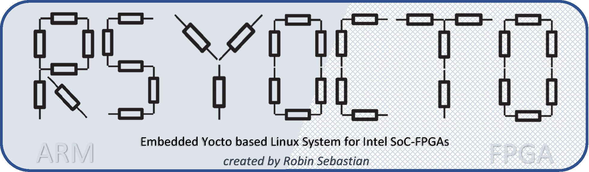

	

### *rsYocto* is an open-source embedded Linux System designed with the Yocto Project and optimized for Intel SoC-FPGAs (*Intel Cyclone V* and *Intel Arria 10* with a *ARM CORTEX-A9*) to achieve the best customization for the strong requirements of modern embedded applications.

	 
	 	 
	 
	 
	 
	 

 

*rsYocto* implements a **modern Linux Kernel (linux-socfpga 5.1)** and brings a set of today fundamentally needed components to Intel SoC-FPGAs and help to **simplify the complex process of development** for FPGA-, Industrial 4.0-, Internet of things- or deep learning applications.

To realize that **Python3** with the Python Package manager **pip** and the **Apache Webserver** with **PHP** are already included. Thereby it is really easy to install Python applications from the *Raspberry Pi* on a powerful Intel SoC-FPGA. *rsYocto* is for it's best optimization complete console based, but the Apache Webserver can bring any GUI to Computers, Smartphones or Tablets, by hosting for example a monitor web interface.

During development, a major concern was placed on the integration of **powerful and simple to install development IDEs** that do not require a JTAG-connection or any cross-building environment. *rsYocto* application can **build, deployed and even debugged over the network**. With the implementation of *Microsoft Visual Studio* and *Visual Studio Code* is a simple installment and quick jumpstart in the development process possible, because all required compilers run directly on *rsYocto*.

It is with the implementation of drivers for **all Hard-IP Interfaces** (e.g. **I²C, CAN,…**) and simple Linux test commands (e.g. **i2c-tools** or **can-utils**) ready for development of industrial connected solutions. With a single command *rsYocto* is capable to **load a new FPGA configuration** or to **read and write the AXI-Bridge Interface to the FPGA**.

The “*makersYoctoSDImage*”- script allows developer to **customize the *rsYocto*-image** with the installment of their own software files or **FPGA configuration files, that will be configured on the FPGA fabric before the Linux boots**.

The final *rsYocto*-Image can be **installed** on a **SD-Card** with any commonly **used Boot-Image creating tools**. Versions are available for the **Terasic DE10 Standard-** (Cyclone V), **Terasic DE10 Nano-** (Cyclone V) and **Terasic Han Pilot** (Arria 10).

On the Terasic DE10 Nano board the **Arduino Uno header** can be used to connect external devices to a Hard-IP Bus, because the HPS interfaces with the pre-installed configuration are routed to FPGA I/O-Pins. 

 
I noticed that right now only desktop Linux systems, like *Ubuntu*, are available for free. They are not designed for embedded SoC-FPGAs and therefore, they cannot be considered for long-term embedded systems.

That was for me the starting point to try to develop my own fully optimized Linux distribution. Shortly after, I announced that the *Intel* development tools and documentations for HPS development are not nearly as good as those for the FPGA part. I noticed that *Intel's EDS* is  in my opinion, only tested to work with *golden reference designs* properly and the documentation is on the other hand often incomplete. At the beginning it was really complicated to get anything running. 
After a hard time, I'm able to present this first working project. To get there, **I designed my own built flow with my own scripts**.

I think everybody will have the same problems that I had during the development. For that reason, **I try to give everybody a solution for their rapid prototyping**.
I'm also **working on a final step by step guide to show every point of the development process** of *rsYocto* with the Yocto-Project.
**I will mark every founded issue with the Intel development tools** with the hope that I can help Intel to improve their software.  

**This project is by far not finished and issue free. I will continue my work and upload newer versions. I invite everybody to submit issues, comments and ideas.**

 

# Features of *rsYocto*

**System Overview of rsYocto**
___
**Selected pre-installed Linux commands:**

`arch` `arm-poky-linux-gnueabi-gcc-nm` `automake` `addgroup` `arm-poky-linux-gnueabi-ar` 
`adduser` `arm-poky-linux-gnueabi-cpp` `asc2log` `autoupdate` `agetty` `ash` `apachectl` 
`arm-poky-linux-gnueabi-g++` `autoconf` `ar` `arm-poky-linux-gnueabi-gcc` `autoheader`
`b2sum` `bg` `bzegrep` `bash` `blkdiscard` `bunzip2` `bzcat` `bzfgrep` `bzless` `basename` 
`bcmserver` `busybox` `bzcmp` `bzip2` `c++` `cangen` `ccache` `chpasswd` `csplit` `cangw` `chgpasswd`
`compgen` `csplit.coreutils` `canlogserver` `cfdisk` `chgrp` `chroot` `cal` `canplayer`  `chgrp.coreutils` `chroot.coreutils` `cmp.diffutils` `compopt` `ctrlaltdel` `cal.util-linux` `cansend` `chattr` `chmem` `chrt` `caller` `cansniffer` `chcon`
`chrt.util-linux` `colcrt` `coproc` `cut.coreutils` `can-calc-bit-timing` `chcon.coreutils` `chmod.coreutils` `chsh` `colrm`
`cvtsudoers` `canbusload` `cat` `chcpu` `choom` `cp.coreutils` `candump` `chvt` `comm` `cpio` `canfdtest` `cc` `chfn` 
`chown.coreutils` `cksum` `comm.coreutils` `cpp`
`date` `fdisk` `FPGA-gpiRead` `FPGA-gpoWrite` `FPGA-readBridge` `FPGA-readMSEL` `FPGA-resetFabric` `FPGA-status` `FPGA-writeBridge` `FPGA-writeConfig`
`g++` `gator` `gdb` `gunzip` `gcc` `git` `gdbserver` `gzip` `hostname` `httpd`  `hexdump` `i2cdetect` `i2ctransfer` `i2cdump` `i2cget` `i2cset` `lscpu` `lsipc`
`microcom` `minicom` `mount` `mkdir` `php` `pip3` `phpdbg` `pydoc3` `python3` `python3.7` `rsync` `route`
`tee`  `tftp` `top` `tac.coreutils` `tcf-agent` `tail` `tcf-client` `telinit` `time` `ttytclsh` `telnet` `tar` `wget`               
___

**Build, debug and deploy your applications over the network**

**Ready for powerful remote development IDEs and fitted with a Web server to host modern web applications**
 
 

# Tutorials 
The entries guide in the usage and the development of *rsYocto* applications is parted in following levels:

| Level | Objective | Guide
|:--|:--|:--|
| 1 | **Booting *rsYocto* on your Board** | [**Getting started Guide**](doc/guides/1_Booting.md)
| 2 | **Use of Hard IP, FPGA-IP and configuration of the FPGA fabric** |[Step by step guide 1](doc/guides/2_FPGA_HARDIP.md)
| 3 | **Debugging C++ applications remotely** | [Step by step guide 2](doc/guides/3_CPP.md)
| 4 | **Debugging Python applications remotely** | [Step by step guide 3](doc/guides/4_Python.md)
| 5 | **Analyzation of applications with ARM DS-5 Streamline** | [Step by step guide 4](doc/guides/5_Streamline.md)
| 6 | **Developing a new FPGA configuration**| [Step by step guide 5](doc/guides/6_newFPGAconf.md)
 

# Folder structure 
| Folder | Content
|:--|:--|
| `doc`    | Documentation  |
| `fpga`    | Quartus Prime projects |
|  `examples/python` | *rsYocto* Python examples 
|  `building` | *rsYocto* building scripts |

Final *rsYocto* SD-Card Versions are available inside the **packages-Part of this repository**!

# Built With
* [Intel SoC FPGA Embedded Development Suite (EDS) 18.1.0.625](https://www.intel.com/content/www/us/en/software/programmable/soc-eds/overview.html) - Linux
* [Intel Quartus Prime 18.1.0 Lite Edition](https://www.intel.com/content/www/us/en/software/programmable/quartus-prime/download.html) - Cyclone V
* [Intel Quartus Prime 18.1.0 Standard Edition](https://www.intel.com/content/www/us/en/software/programmable/quartus-prime/download.html) - Arria 10
* [The Yocto Project](https://www.yoctoproject.org/) 
* [meta-altera](https://github.com/kraj/meta-altera) 
* [meta-openembedded](https://github.com/openembedded/meta-openembedded)
  * [meta-python](https://github.com/openembedded/meta-openembedded/tree/master/meta-python) 
  * [meta-webserver](https://github.com/openembedded/meta-openembedded/tree/master/meta-webserver)
  * [meta-networking](https://github.com/openembedded/meta-openembedded/tree/master/meta-networking) 
* [meta-linaro](https://git.linaro.org/openembedded/meta-linaro.git)
* [meta-rstools](https://github.com/robseb/meta-rstools)
 

# Development process

**Required Build Flow to create rsYocto**

This illustration shows my procedure and the required complexity to create *rsYocto*. With this project I want to give other developers a fully functional system to reduce their development effort.
 

# Author
* **Robin Sebastian**

*rsYocto* a project, that I have fully developed on my own. I is a academic project.
Today I'm a Master Student of electronic engineering with the major embedded systems. 
I ‘m looking for an interesting job offer to share and deepen my shown skills starting summer 2020.

